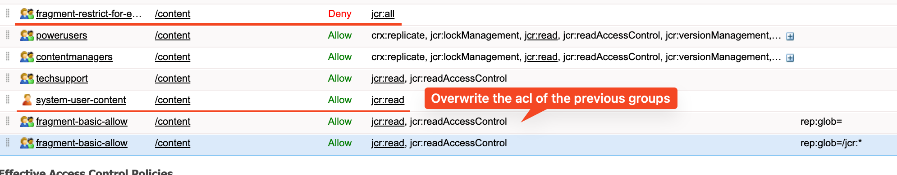
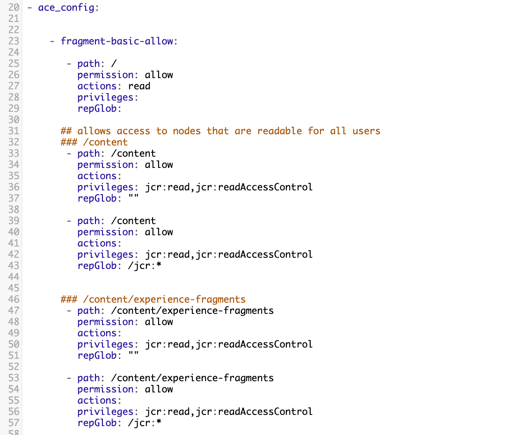

# ACL-Design-Approach-for-AEM

## AEMのACL設計のよくある失敗

1. 新しい要望が出るたびにACL・グループ設計が複雑化し、工数や不具合の増加につながる。
2. 複数グループを組み合わせたときのテスト工数が膨大に増加する。またはテストし切れず運用後に不具合が発覚する。
3. 設計書の更新まで手が回らず、設計と実装にGAPが生まれる。誰も正しいACL設計を把握出来なくなる。
4. 完全性・冪等性を維持したACLのリリース方法が確立されていない。それゆえ環境毎にACL設定が微妙に異なる。
5. AEMの各標準機能が正常に動作するために、どのようなACLが必要か把握出来ていない。そのため運用後に標準機能が動作しないことが発覚する。
6. テストを手動で実施している。そのため網羅性・テスト品質ともに高くならない。

## ACL設計が難しい理由

* AEMは不完全な Role-based access control(RBAC)
  * Built-in groups が少なすぎ。貧弱すぎ。
  * ビジネスユーザ向けの新しいRoleを定義するために、DatabaseレイヤーのRead/Write/Create/Delete権限から設計しないといけないのはおかしすぎるだろ
  * AEMは柔軟なコンテンツ管理が行える点が強み。一方、認可設計としてはコンテンツ設計をかっちり決めたい。相反するためAEMが認可管理が苦手なのは致し方ない。。。
    * Attribute Based Access Control(ABAC)なら両立可能？？
* 「どの機能を利用できるか」と「どのコンテンツにアクセスできるか」をACLという同じ仕組みで制御する仕様のため、ACL設計をする上で認可モデルの深い理解が求められる
* ACLをコードで管理できない。

## Best Practice for AEM ACL Design

1. [NetcentricのAC Tool](https://github.com/Netcentric/accesscontroltool)を使用する。
2. [Best Practices](https://github.com/Netcentric/accesscontroltool/blob/develop/docs/BestPractices.md)に従う。
3. フォルダ／ノード設計時にACL設計も同時に行い、シンプルなACL設計になるようにフォルダ／ノード構造を設計する。
4. 複雑なACL設計を避けられるように要件定義・設計をする。複雑なACLが求められる要件はそのデメリットをしっかり伝え、必須か否かクライアントによく検討してもらう

## What's AC Tool

* The AC tool provide the simple way to manage the specification and deployment of complex Access Control Lists in AEM.

## Features of AC Tool

* easy-to-read Yaml configuration file format
* run mode support
* automatic installation with install hook
* cleans obsolete ACL entries when configuration is changed
* ACLs can be exported
* management of user's key stores and the global trust store
* stores history of changes
* ensured order of ACLs
* built-in expression language to reduce rule duplication
See [the slide of adaptTo() 2016](https://adapt.to/2016/presentations/adaptto2016-ac-tool-jochen-koschorke-roland-gruber.pdf) for details


## How can AC tool resolve the problems?

### ACL・グループ設計の複雑化を避けるには？

[Best Practices](https://github.com/Netcentric/accesscontroltool/blob/develop/docs/BestPractices.md)に従うことが最も大切。そうすることで、柔軟で見通しの良い設計が行える。
その中でも重要なTipsは下記

* Use fragment groups for functional aspects and content access
* Always use Allow statements. Avoid using a Deny statement
* Consider access rights when designing you content structure

### 複数グループを組み合わせた時の不具合を防ぐには

グループAとグループBで相反するACL設定がされており、グループA、Bの両方にユーザが所属した場合にACLが競合し期待する動作にならないことがある。
競合を避けるためには
* `deny`ルールはトップ階層のノードにのみ定義する
* 下層階層には`allow`ルールのみを定義し、極力`deny`ルール使わない



### 設計書の陳腐化を防ぐアイデア

AC Toolを使えばACLをYAMLとして定義できる
そしてYAMLにはコメントアウトを記述できるので、ACL設計に対してコメントを残すことで、YAMLファイルでACL設計書を代用することができる。
（クライアントがExcelの設計書を作れというかもしれないが）




### 完全性・冪等性を維持したACLのリリース方法

* AC Toolを使うと、ACLをコードとして管理し、Javaのコードと同じようにGit管理および資源移送が可能になる。
* また完全性・冪等性も備えるので、安心してACLをリリースすることができる。

以前はACS CommonsのACL Packagerというツールが主流であったが、完全性・冪等性を備えておらず、ACL PackagerでACLを移送すると知らず知らずのうちに、環境毎に差が出ることが多かった。

### 標準機能に必要なACLを適切に把握するアイデア

* AEMはいくつかのBuilt-in groupを提供しており、ビジネス要件に応じて、これらのグループを拡張・または参考にすると良い。
* AC Toolを用いると、AEMないの全グループのACLをYAML形式で出力ができるので、Built-in groupに定義されているACLを参照することで、ACL設計の抜け漏れを減らすことができる。
  * ページ公開するにはページ自体の`Replicate`権限に加えて、テンプレート、ポリシーの`Replicate`権限も必要

### ACLの効率的なテスト方法


## the Best Practice is great, but...

But, it tends to be complex if we completely follow this appoarch.
So, We recommend a simpler approach, which we will describe later.

## A simplified approach #1

Best Practice では、各機能に対応したfragmentグループを作成し、ロールグループに必要な機能のみをアサインべきだと言っている。
しかし、これをプロジェクト毎に設計・実装するのは大変だし、本来はAEM製品側がfragmentグループを提供すべきだが、現実そうはなっていない。

幸いにも、多くのAEMプロジェクトで求められるロールは下記の３種類かその変化系だけだ。
* 編集者
* 公開者
* 承認者
  
そしてこれらのロールは content-authors, dam-users, workflow-usersなどのbuit-inグループを組み合わせることで十分に表現できる。
そのためbuilt-inグループをfragmentグループの代用とすることで設計にかかるコストと時間を省くことができる。

### Useful built-in groups

再利用性の高いbuilt-in groupを下記表にまとめる。
例えばWebサイトの編集に必要な機能であれば、content-authorsがカバーしている。
しかし、built-inグループはアクセス許可を与えたくないノードへのアクセス権を既に持っている場合がある。
例えばcontent-authorsは/content配下の読み取り・書き込み権限を持っているが、/content配下の特定のサイトにのみアクセス権を付与したい、という要件は非常にポピュラーだ。
これに対する対策は別のスライドで説明する。

| Built-in groups         | Description                                                                                                                                                                        |
| ----------------------- | ---------------------------------------------------------------------------------------------------------------------------------------------------------------------------------- |
| contributor             | Basic privileges that allow the user to write content (as in, functionality only).                                                                                                 |
| content-authors         | Group responsible for content editing. Requires read, modify, create, and delete permissions.                                                                                      |
| dam-users               | Out-of-the-box reference group for a typical AEM Assets user.                                                                                                                      |
| projects-administrators |                                                                                                                                                                                    |
| projects-users          |                                                                                                                                                                                    |
| user-administrators     | Authorizes user administration, that is, the right to create users and groups.                                                                                                     |
| workflow-administrators |                                                                                                                                                                                    |
| workflow-editors        | Group that is allowed to create and modify workflow models.                                                                                                                        |
| workflow-users          | A user participating in a workflow must be a member of group workflow-users. Gives the user full access to: /etc/workflow/instances so that they can update the workflow instance. |

Ref: [User Administration and Security](https://experienceleague.adobe.com/docs/experience-manager-65/administering/security/security.html?lang=en)

### built-in groupsを必ず使用しないといけないケース

特定のグループに所属しているかどうかを条件にUI制御している場合がある。
例えば、下記のUIは `workflow-users` に所属する場合のみ表示される。
こうした点を踏まえてえも、fragment groupを設計するよりも、built-in group を活用する方法を確立する方が有用だと考える。

```
 if (checkUserGroup(resolver, userSession, workflow_users)) {
     return true;
 } 
```

Ref: 
* /libs/cq/translation/cloudservices/rendercondition/isWorkflowUser/isWorkflowUser.jsp
* [Render Condition](https://developer.adobe.com/experience-manager/reference-materials/6-5/granite-ui/api/jcr_root/libs/granite/ui/docs/server/rendercondition.html#)

## A simplified approach #2

Best Practice では、Read/write access to contents はcontent groupによって提供されるべきだと言っている。
基本的に同意するが、下記の点でより実用的なアプローチがあると考える。

* コンテンツに対してどのアクセス権を与えるかはビジネス要件で決まる。しかし、ロールとコンテンツに応じて求められる権限は細かく変わるため、Read/Writeという観点でfragmentグループを作成すると、グループ数が非常に多くなることが懸念される。
* コンテンツを公開することができるかどうかは直感的には機能観点だが、AEM内部ではACLの１つとして制御される。そのため、公開権限自体はfragment groupではなく、content groupで管理する方が見通しが良い

そこでロールに１対１対応するようにcontent groupを作り、そのグループでそのロールに必要なコンテンツに対するACLを全て管理する方が未投資が良い。
また、公開権限についてもcontent group で管理する。

## ケーススタディ | 要件

下記要件のACL・グループ設計を考えてみる。

* マルチサイト(We-Retail)
* 本社がlanguage-masterのコンテンツを管理し、Live CopyおよびLanguage Copyを使って各国・言語へ展開する
* 支社は自分が管轄するリージョンサイトのコンテンツを管理する。
* ページ公開には必ず承認者の商品が必要
* ページの編集者はページの作成・更新が可能
* ページの公開者はページの作成・更新・削除および公開が可能

## ケーススタディ | アーキテクチャ

### ACLの適用順序

* Q. ２つのグループ間で相反するACLが定義されている場合、２つのグループに所属するとどちらのACLが優先されるか。
* A. 後に設定されたACLが優先される。この性質を利用すると、Built-in　グループ内で定義されているACLを別のグループで定義したACLに書き換えることが可能。(eg. fragment-restrict-for-everyone)

* Q. １つのグループでは `deny jcr:all` が定義され、もう１つのグループでは `allow jcr:read` が定義されている。`allow jcr:read` の方が `deny jcr:all` より後に設定された場合、どのようなACLが有効になるか
* A. 
    | privileges | permission |
    | ---------- | ---------- |
    | read       | allow      |
    | modify     | deny       |
    | create     | deny       |
    | delete     | deny       |
    | acl_read   | deny       |
    | acl_edit   | deny       |
    | replicate  | deny       |

## ケーススタディ | Global Fragments

Global Fragmentは以下の２グループを定義する。

* fragment-restrict-for-everyone
  + `Deny`ルールのみを定義する。
  + `Deny`ルールはこのグループ以外では原則定義してはならない。
  + 下記のユーザコンテンツ領域へのアクセス禁止するACLを定義
    - /content, /content/experience-fragments, /content/projects, /content/dam, 
    - /content/dam/projects, /content/dam/collections, /content/cq:tags, /conf
  + Built-in groupに定義されたACLで上書きが必要なものもここで定義
* fragment-basic-allow
  + 全サイト、全グループ共通で必要な`Allow`ルールを定義
  + 主に、親ノードへのアクセスは許可するが、子ノードへのアクセス権限を与えず、親ノードのみのアクセス権を与える時のルールを記載
    - [White listing nodes](https://github.com/Netcentric/accesscontroltool/blob/develop/docs/BestPractices.md#white-listing-nodes)

## ケーススタディ | Content Fragments

Content Fragmentsは下記の方針で作成する。

* language-mastersおよび各リージョンサイトの管理者は異なるため、リージョン毎にContent グループを分ける
* さらに各リージョン毎に編集者、公開者、承認者というロールを分けて作成する。
  + content-${sitePrefix}-${country}-for-${role}
* 各ロールで付与するACLは下記
  + acl_read権限を与えないと
    | role      | priviledge                         |
    | --------- | ---------------------------------- |
    | editor    | read,modify,create                 |
    | publisher | read,modify,create,delete,acl_read |
    | approver  | read,modify,create,delete,acl_read |

## テスト
